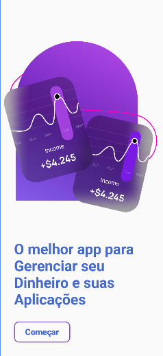
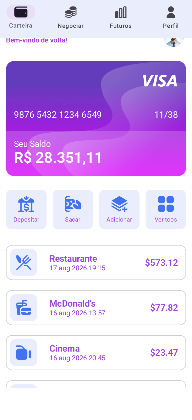
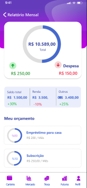

# 💰 App Financeiro - Gerenciador Financeiro Pessoal

Um aplicativo Android moderno para gestão de finanças pessoais, desenvolvido com **Kotlin** e **Jetpack Compose**. O projeto oferece uma interface intuitiva e fluida para acompanhamento de despesas, receitas, orçamentos por categoria e relatórios financeiros detalhados.

---

## 📱 Telas e Funcionalidades

### 1. 🚀 Tela de Introdução (IntroScreen)
- Apresentação inicial do aplicativo com design atraente.
- Botão de acesso rápido para iniciar a navegação.

### 2. 📊 Dashboard Principal (MainScreen)
- **Header Personalizado**: Saudação ao usuário e foto de perfil.
- **Cartão de Crédito/Conta**: Exibição do cartão financeiro interativo com saldo.
- **Ações Rápidas (Action Buttons)**: Botões de atalho para enviar dinheiro, pagar contas, depositar, etc.
- **Lista de Transações Recentes**: Histórico de despesas com categoria, ícone, data/hora e valor.
- **Navegação Inferior (Bottom Navigation)**: Barra de navegação customizada para alternar entre as seções.

### 3. 📈 Tela de Relatórios e Orçamentos (ReportScreen)
- **Gradient Header**: Cabeçalho moderno com gradiente e botão de voltar.
- **Card de Estatísticas Centrais**:
  - Gráfico de progresso circular (`CircularProgressBar`) exibindo o saldo total.
  - Indicadores detalhados de **Receitas** e **Despesas**.
- **Resumo Financeiro (Summary Columns)**: Colunas com informações de Saldo Total, Receita e Poupança com variação percentual.
- **Orçamentos por Categoria (Budget Items)**: Lista de metas de gastos por categoria com barras de progresso circulares personalizadas.

---

## 🛠️ Tecnologias Utilizadas

- **Linguagem**: [Kotlin](https://kotlinlang.org/)
- **UI Toolkit**: [Jetpack Compose](https://developer.android.com/jetpack/compose)
- **Design System**: [Material Design 3](https://m3.material.io/)
- **Layout Constraints**: [ConstraintLayout Compose](https://developer.android.com/jetpack/compose/layouts/constraintlayout)
- **Arquitetura**: MVVM (Model-View-ViewModel)
- **Gerenciamento de Estado**: State, ViewModels e Coroutines

---

## 📂 Estrutura do Projeto

```
com.example.appfinanceiro/
├── Activity/
│   ├── DashboardActivity/
│   │   ├── Components/        # Componentes reutilizáveis do Dashboard (Header, Card, Actions, etc.)
│   │   └── Screens/           # Tela principal (MainScreen)
│   ├── IntroActivity/
│   │   └── Screens/           # Tela de Boas-Vindas (IntroScreen)
│   └── ReportActivity/
│       └── Components/        # Componentes do Relatório (GradientHeader, CircularProgressBar, etc.)
│           └── Screens/       # Tela de Relatório (ReportScreen)
├── Domain/                    # Modelos de Dados (ExpenseDomain, BudgetDomain)
├── Repository/                # Fonte de Dados e Repositórios (MainRepository)
├── ViewModel/                 # Camada de Regra de Negócio (MainViewModel)
└── ui/theme/                  # Cores, Tipografia e Tema do aplicativo
```

---


## 📸 Screenshots

<p align="center">
  
  
  
</p>

## 🚀 Como Executar o Projeto

### Pré-requisitos
- **Android Studio**: Jellyfish / Koala / Ladybug ou superior.
- **JDK**: Java 17 ou superior.
- **Dispositivo**: Emulador Android ou dispositivo físico com Android 7.0 (API 24) ou superior.

### Passo a Passo

1. **Clonar o Repositório**:
   ```bash
   git clone https://github.com/SEU-USUARIO/AppFinanceiro.git
   ```

2. **Abrir no Android Studio**:
   - Abra o Android Studio.
   - Selecione **Open** e navegue até a pasta do projeto clonado.

3. **Sincronizar o Gradle**:
   - Aguarde o Android Studio realizar o *Gradle Sync* e baixar as dependências automaticamente.

4. **Executar o Aplicativo**:
   - Selecione o emulador ou dispositivo conectado.
   - Clique no botão **Run** (`Shift + F10`) ou no ícone ▶️.

---

## 📝 Licença

Este projeto foi desenvolvido para fins de aprendizado e portfólio. Sinta-se à vontade para utilizar e contribuir!

---
Desenvolvido com 💜 usando Kotlin & Jetpack Compose.
